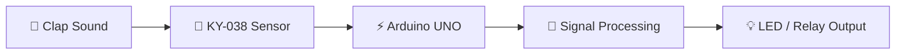

<div align="center">


<br><br>


<br><br>

<p align="center">


</p>

<br>

<h2>👏 Smart Sound Activated Switching System 👏</h2>

<p align="center">
An Arduino automation project that uses the KY-038 sound sensor to detect clap sounds and control electronic devices intelligently.
</p>

</div>

---

# ⚡ Project Introduction

## 👏 Clap Switch with Arduino using KY-038 Sensor

This project demonstrates how sound-based automation can be implemented using an **Arduino UNO** and a **KY-038 microphone sound sensor**.

The system detects clap sounds and toggles connected devices such as:

- 💡 LEDs
- 🔌 Relay modules
- 🏠 Home appliances
- ⚡ Smart automation circuits

The KY-038 sound sensor detects sound waves and provides digital or analog signals to the Arduino for processing. :contentReference[oaicite:0]{index=0}

---

# 🌟 Project Features

<div align="center">

| 🚀 Feature | 📌 Description |
|---|---|
| 👏 Clap Detection | Detects clap sound instantly |
| 💡 Smart Switching | Toggle LEDs and appliances |
| 🎤 Sound Sensor Integration | Uses KY-038 microphone module |
| ⚡ Fast Response | Real-time clap processing |
| 🔌 Relay Support | Control AC devices |
| 📱 Beginner Friendly | Simple Arduino implementation |
| 🧠 Automation Logic | Intelligent sound handling |
| 🛠️ Easy Circuit Setup | Minimal hardware requirements |

</div>

---

# 🎯 Project Objective

The primary objective of this project is to build a simple sound-controlled automation system using Arduino and a microphone sensor.

### ✅ Goals Achieved

- Detect clap sounds
- Control electronic devices
- Learn sensor interfacing
- Understand Arduino automation
- Implement real-time switching logic

Arduino clap switch projects commonly use sound sensors like KY-038 with digital signal processing for clap-based automation systems. :contentReference[oaicite:1]{index=1}

---

# 🧠 How The System Works



---

# 🔩 Hardware Components

<div align="center">

| 🔧 Component | 📌 Quantity |
|---|---|
| Arduino UNO | 1 |
| KY-038 Sound Sensor | 1 |
| LED | 1 |
| 220Ω Resistor | 1 |
| Breadboard | 1 |
| Jumper Wires | Multiple |
| Relay Module *(Optional)* | 1 |

</div>

The KY-038 module contains a microphone and LM393 comparator circuit used for sound detection applications. :contentReference[oaicite:2]{index=2}

---

# 🛠️ Software & Technologies

<div align="center">

<table>

<tr>

<td align="center" width="180">
<br>
<b>Arduino IDE</b>
</td>

<td align="center" width="180">
<br>
<b>C++</b>
</td>

<td align="center" width="180">
<br>
<b>VS Code</b>
</td>

<td align="center" width="180">
<br>
<b>GitHub</b>
</td>

</tr>

</table>

</div>

---

# 🔌 Circuit Connections

## 📍 KY-038 to Arduino

| KY-038 Pin | Arduino Pin |
|---|---|
| VCC | 5V |
| GND | GND |
| DO | Digital Pin 2 |

## 💡 LED Connections

| LED Pin | Arduino Pin |
|---|---|
| Positive | Pin 9 |
| Negative | GND via 220Ω resistor |

The KY-038 sensor provides both analog and digital outputs for sound-based applications. :contentReference[oaicite:3]{index=3}

---

# 📸 Project Demonstration

<div align="center">


</div>

---

# 💻 Arduino Logic

## ⚡ Working Principle

1️⃣ User claps near microphone sensor  
2️⃣ KY-038 detects sound intensity  
3️⃣ Sensor sends digital signal to Arduino  
4️⃣ Arduino processes clap event  
5️⃣ LED or relay state toggles automatically  

Digital clap detection is commonly implemented using the KY-038 digital output pin connected to Arduino GPIO pins. :contentReference[oaicite:4]{index=4}

---

# 📂 Repository Structure

```bash
📦 Clap-Switch-Arduino
 ┣ 📂 circuit-diagram
 ┣ 📂 images
 ┣ 📂 code
 ┃ ┗ 📜 clap_switch.ino
 ┣ 📜 README.md
 ┣ 📜 components.txt
 ┗ 📜 connections.md
```

---

# ⚙️ Installation Guide

## 📥 Clone Repository

```bash
git clone https://github.com/Nksnaveenks/Clap-Switch-with-Arduino-using-KY-038-Sensor.git
```

---

## 📂 Open Arduino Project

Open the `.ino` file using:

```bash
Arduino IDE
```

---

## ▶️ Upload Code

### Step 1
Connect Arduino UNO using USB cable.

### Step 2
Select board and COM port.

### Step 3
Click:

```bash
Upload ▶️
```

### Step 4
Clap near the sensor to test the switch 👏

Arduino IDE is commonly used for compiling and uploading Arduino sketches to compatible boards. :contentReference[oaicite:5]{index=5}

---

# 📈 Applications

<div align="center">

| 🏠 Application | 🚀 Usage |
|---|---|
| Smart Home | Clap-controlled lights |
| Automation Systems | Sound-based switching |
| IoT Projects | Voice-triggered devices |
| Learning Projects | Arduino sensor interfacing |
| Accessibility | Hands-free device control |

</div>

---

# 🌍 Real-World Usage

This clap switch concept can be expanded for:

- 🏠 Home automation
- 🤖 Robotics
- 📡 IoT systems
- 🔔 Smart alert systems
- 💡 Intelligent lighting

Sound sensor modules are frequently used in DIY automation, robotics, and clap-controlled electronic systems. :contentReference[oaicite:6]{index=6}

---

# 🚀 Future Improvements

- 🤖 AI sound recognition
- 📱 Mobile app integration
- 🌐 IoT cloud connectivity
- 🎤 Voice command support
- ⚡ Multiple clap pattern detection
- 🔊 Noise filtering algorithms
- 🏠 Smart home integration

---

# 📚 Learning Outcomes

<div align="center">

| 📘 Topic | 🚀 Skills Learned |
|---|---|
| Arduino Programming | Embedded coding |
| Sensor Interfacing | KY-038 integration |
| Automation Logic | Clap-based switching |
| Circuit Design | Electronic prototyping |
| Real-Time Processing | Signal detection |

</div>

---

# 🤝 Contribution Guide

Contributions are welcome!

## 📌 Steps To Contribute

### 1️⃣ Fork Repository

### 2️⃣ Clone Repository

```bash
git clone https://github.com/your-username/Clap-Switch-with-Arduino-using-KY-038-Sensor.git
```

### 3️⃣ Create Branch

```bash
git checkout -b feature-name
```

### 4️⃣ Commit Changes

```bash
git commit -m "Added new feature"
```

### 5️⃣ Push Repository

```bash
git push origin feature-name
```

### 6️⃣ Open Pull Request 🚀

---

# 🛡️ License

This project is licensed under the **MIT License**.

---

# 👨‍💻 Developer

<div align="center">


# 🚀 Naveen K S

### Associate Software Engineer @ Accenture

<br>

<a href="https://github.com/Nksnaveenks">

</a>

<a href="https://linkedin.com">

</a>

</div>

---

# 💭 Innovation Quote

> “Automation begins when machines start understanding human interaction.”

---

<div align="center">


# ⭐ Star This Repository If You Like The Project ⭐

</div>
